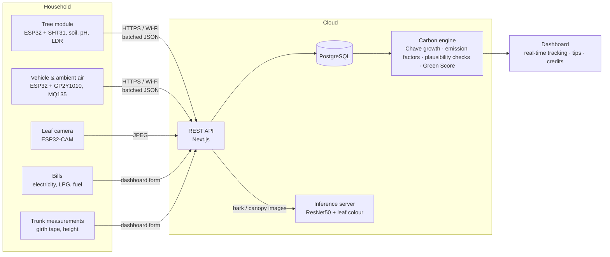

# HCCMS: Household Carbon Credit Monitoring System

> **If you can measure it, you can change it.**

An IoT system that links a household's real carbon emissions to the carbon its own trees absorb. Low-cost ESP32 sensor modules measure the trees and the air around the home. A cloud dashboard turns those measurements, together with the household's energy and fuel bills, into a net carbon balance, a **Green Score** and accrued **carbon credits**.

| | |
| --- | --- |
| **Theme** | Smart & Sustainable Tamil Nadu |
| **Sub-theme** | Urban Heat, Air & Environmental Mitigation |
| **Title** | Environmental performance evaluation tools |
| **Team** | Tech Bloomers, Loyola-ICAM College of Engineering & Technology (Team lead: Tabitha) |

---

## The problem

- Households lack accountability for their role in maintaining a safer environment.
- Tree plantation is encouraged, but its environmental contribution is never measured or monitored.
- There is no simple system that links household emissions and plantation efforts to carbon credits.

Climate action fails when responsibility is abstract. It succeeds when impact is measurable.

## Local context: urban resilience in Chennai

| Location | Average PM2.5 (µg/m³) | Deviation from city average | Health category |
| --- | --- | --- | --- |
| Alandur | 47 | +30% | Unhealthy |
| Kodungaiyur | High | Above citywide average | Severe hotspot |
| Perungudi | High | Above citywide average | Severe hotspot |
| Citywide average | 31–36 | — | Moderate |

- City-wide averages mask hyper-local build-up: Alandur runs **30% above** the city average.
- PM2.5 levels are about **3× the WHO limit**, linked to roughly 8,000 premature deaths a year in the city.
- In winter 2024–25, daily PM2.5 peaked at **119 µg/m³** ("poor" to "unhealthy").
- Green cover fell by **13%** in the last decade.
- Land surface temperature in the Chennai Metropolitan Area rose from **35.6 °C to 47.2 °C** (1991–2021). Built-up area explains much of the heat (R² = 0.5694), and household greenery can lower local surface temperature by up to 2.5 °C.

Measuring at the household level shows each tree's contribution and each home's emissions where city-wide figures can't. That gives residents, and local bodies offering property-tax or utility rebates, something concrete to act on.

---

## The solution

1. An IoT household carbon monitoring system built on the **ESP32**.
2. **Tree carbon** is measured the way foresters measure it: species wood density, trunk diameter and height in the **Chave et al. (2014)** allometric equation, re-measured over time. Only *growth* earns credit.
3. A **tree module** (soil moisture, SHT31 temperature and humidity, soil pH, LDR sunlight) and a **leaf camera** monitor how well the tree is cared for. They drive care alerts and the Tree Care part of the score. **Sensors never change the carbon figures.**
4. **Household emissions** come from electricity, LPG and fuel bills, converted with national and IPCC emission factors. A **vehicle & ambient air module** (PM2.5, MQ135) shows the air the household breathes.
5. All sensor data travels over the home's Wi-Fi to a cloud database through a REST API, with plausibility checks against tampering.
6. The **carbon engine** computes the net balance and a **Green Score** that rewards households for growth and care they actually control.



### Work flow

**Sensors collect in real time** → **ESP32 processes the data** (sampling, median filtering, 1-minute averages, offline buffer) → **data is transmitted via Wi-Fi to the cloud server** → **the cloud processes the data** (validation, storage, plausibility checks, carbon engine) → **carbon credit score on the web dashboard**.

### Project phases

| Phase | Scope | Status |
| --- | --- | --- |
| **1. Basic IoT implementation** | ESP32 + sensors, data collection on ThingSpeak, first score calculator | Completed (prototype) |
| **2. Advanced analysis & carbon credit calculation** | Cloud database and REST API, measurement-based tree carbon, household emissions, Green Score, tamper checks, ML species and leaf-colour analysis, real-time dashboard | **This repository** |
| **3. Optimisation & scalability** | Additional and higher-grade sensors, community roll-up, incentive integrations | Planned |

---

## Hardware

Built from low-cost, widely available parts. Data goes over the household's existing Wi-Fi. Carbon is estimated from tree measurements, so no expensive oxygen or gas-flux sensors are needed.

### Tree module: `hardware/tree_module/`

| Part | Measures | ESP32 pin |
| --- | --- | --- |
| ESP32 DevKit | Controller, Wi-Fi | — |
| SHT31 (in a vented radiation shield) | Air temperature, humidity | I²C: GPIO 21 / 22 |
| Capacitive soil moisture probe | Volumetric soil moisture (%, calibrated dry/wet) | GPIO 34 |
| PH-4502C pH module + probe | Soil pH (two-point calibration with pH 4 and 7 buffers) | GPIO 35 (via 10k/20k divider) |
| LDR + 10k divider | Sunlight, % of full sun | GPIO 32 |

The SHT31 replaces the prototype's DHT11, which drifts quickly and fails in outdoor humidity and rain.

Every 5 s the module samples each sensor (median of 9 ADC reads to reject spikes) and stores a 1-minute average. A serial `cal` command prints raw millivolts for calibration.

### Leaf camera: `hardware/leaf_camera/`

AI-Thinker **ESP32-CAM**, fixed 1–2 m from a dense part of the canopy. It wakes every 2 hours, captures only between 10:00 and 15:00 IST with white balance locked to daylight, uploads a VGA JPEG and returns to deep sleep. **All image analysis runs on the server**; the ESP32 only captures and uploads.

The ESP32-CAM's small sensor has limited dynamic range and struggles with glare, so its leaf-colour result is treated as an **indicative care signal only**. It feeds alerts and the Tree Care score, never carbon. Species identification uses a **phone photo of the bark**, taken by the household and confirmed by them, not the ESP32-CAM.

### Vehicle & ambient air module: `hardware/vehicle_module/`

| Part | Measures | ESP32 pin |
| --- | --- | --- |
| ESP32 DevKit | Controller, Wi-Fi | — |
| MQ135 | CO₂ concentration (ppm) | GPIO 34 (via divider; 5 V module) |
| Sharp GP2Y1010AU0F | PM2.5 dust density (µg/m³) | GPIO 35 (Vo, via divider), GPIO 25 (LED) |
| SHT31 (optional) | Ambient temperature, humidity | I²C: GPIO 21 / 22 |

The MQ135 is warmed up (24 h burn-in, then 3 minutes after each power-on) and calibrated outdoors against 420 ppm atmospheric CO₂. Its resistance ratio Rs/R0 is converted using the datasheet curve `ppm = 116.60 × (Rs/R0)^−2.769`. The dust sensor follows the datasheet's 0.28 ms LED-pulse sampling and is zeroed in clean air. Calibration values persist in flash.

What this module can and cannot do:
- **The MQ135 is not a gas-quantification instrument.** It is a heated metal-oxide sensor that drifts with temperature and humidity and cross-reacts with CO, NH₃ and VOCs. Its CO₂ value is shown as an *indicative trend* and is never used to compute emissions.
- **A static module mostly measures neighbourhood air.** PM2.5 from one household's vehicle can't be separated from street and city pollution, so ambient air is shown for residents' awareness and health tips but is **excluded from the Green Score**.
- **Vehicle CO₂ comes from fuel purchases** (litres × IPCC factor), which is how transport emissions are normally inventoried.
- Phase 3 upgrade path: an NDIR CO₂ sensor (SCD40 / MH-Z19) and a laser PM sensor (PMS5003 / SDS011).

### Firmware design (all modules)

- **Local data buffering during internet outages.** A ring buffer holds 6 hours of 1-minute readings. Each reading is stamped with `millis()` and converted to Unix time at upload, so readings taken before Wi-Fi or NTP came up still get correct timestamps.
- **Batched, idempotent uploads.** Up to 30 readings per request. The server ignores duplicates by `(device, timestamp)`, so retries never double-count.
- **ADC1 pins only.** ADC2 is unusable while Wi-Fi is active on the ESP32.
- **Per-device keys.** Each board authenticates with its own bearer key, issued once from the dashboard and stored on the server only as a SHA-256 hash.

---

## Software

| Layer | Technology |
| --- | --- |
| Firmware | Arduino IDE, Embedded C/C++ (ESP32 Arduino core), ArduinoJson, Adafruit DHT |
| Web app & REST API | Next.js 15 (React 19, TypeScript), Tailwind CSS, Recharts |
| Database | PostgreSQL (any managed Postgres via `DATABASE_URL`), or embedded PGlite for a single-server install |
| ML inference | Python, Flask, PyTorch (CPU), Pillow, NumPy |
| Species model | ResNet50 trained on BarkVisionAI bark images: 13 species, 88.3% validation accuracy |

### Deploying on Vercel

Vercel deployments require a managed PostgreSQL database because serverless
function filesystems are not persistent or writable for the embedded PGlite
database. Set `DATABASE_URL` in the Vercel project's Environment Variables to
the database connection string, enable it for the environments you deploy
(Production, Preview, and/or Development), and redeploy. The schema is applied
automatically when the app connects. Use embedded PGlite only on a
single-server deployment with persistent disk.

### Repository layout

| Path | Contents |
| --- | --- |
| `app/` | Pages (`/`, `/h/[id]` dashboard, `/h/[id]/manage`) and REST API routes under `app/api/` |
| `components/` | Dashboard UI: hero, live modules, trees, balance chart, score, tips |
| `lib/carbon.ts` | Carbon engine: Chave biomass, measurement-based growth and safeguards, tree care index, Green Score |
| `lib/species.ts` | Species database (wood density, growth class) |
| `lib/emission-factors.ts` | Emission factors with sources; air-quality limits |
| `lib/dashboard.ts` | Aggregates readings, scans and bills into the dashboard view |
| `db/schema.sql` | Database schema, applied automatically on first connection |
| `inference/` | Flask server for species identification and leaf-health analysis |
| `hardware/` | Firmware for the three modules |
| `docs/` | Project deck |

### Data model

| Table | Holds |
| --- | --- |
| `households` | Name, locality, city, members, hashed owner key |
| `devices` | Each ESP32 board: kind (`tree`, `vehicle`, `camera`), hashed device key, last seen |
| `trees` | Species, latest trunk diameter (DBH) and height, linked tree module and camera |
| `tree_measurements` | Every trunk and height measurement with its date; the basis of all carbon credits |
| `readings` | Time-series sensor readings: temperature, humidity, soil moisture, pH, light, CO₂, PM2.5 |
| `leaf_scans` | Per-image foliage indices: green ratio, VARI, vegetation coverage |
| `activities` | Bills and receipts: electricity kWh, LPG kg, petrol/diesel litres, CNG kg, with billing period |

### REST API

| Method & path | Auth | Purpose |
| --- | --- | --- |
| `POST /api/ingest` | Device key | Upload one reading or a `{ "readings": [...] }` batch with Unix `ts` |
| `POST /api/ingest/leaf-image` | Camera key | Upload a raw JPEG of the canopy |
| `POST /api/identify-tree` | — | Identify a species from a bark photo (top-3 candidates) |
| `GET /api/households` | — | Public directory of households |
| `POST /api/households` | — | Register a household; returns the owner key once |
| `GET /api/households/{id}/dashboard` | — | Full computed dashboard: readings, trees, balance, score, tips |
| `POST /api/households/{id}/devices` | Owner key | Provision a module; returns its device key once |
| `POST`/`DELETE /api/households/{id}/devices/{deviceId}` | Owner key | Rotate a device key / remove a device |
| `POST /api/households/{id}/trees` | Owner key | Register a tree (girth or diameter, height, links) |
| `PATCH`/`DELETE /api/households/{id}/trees/{treeId}` | Owner key | Add a new measurement (appended to history), relink or remove a tree |
| `POST /api/households/{id}/activities` | Owner key | Log a bill or fuel purchase |
| `DELETE /api/households/{id}/activities/{activityId}` | Owner key | Remove a logged activity |
| `GET /api/health` | — | Database and inference-server status |

Ingest payload fields: `temperature` (°C), `humidity` (%), `soil_moisture` (%), `ph`, `light` (%), `co2_ppm`, `pm25` (µg/m³). Each module may only send its own fields. Out-of-range values, timestamps more than 14 days old and timestamps in the future are rejected individually, and the response reports `stored`, `duplicates` and `rejected`.

---

## How carbon is calculated

Everything shown on the dashboard is computed from stored measurements. Nothing is simulated.

### 1. Carbon stored in each tree

The household measures the trunk girth at 1.3 m with a tape (diameter D = girth ÷ π) and estimates the height. Above-ground biomass uses the pantropical allometric model of **Chave et al. (2014)**:

```
AGB (kg) = 0.0673 × (ρ × D² × H)^0.976
```

| Symbol | Meaning |
| --- | --- |
| ρ | Wood density, g/cm³, per species (Global Wood Density Database) |
| D | Diameter at breast height, cm |
| H | Height, m |

```
Below-ground biomass = 0.24 × AGB                    (root:shoot ratio, Cairns et al. 1997 / IPCC)
Carbon               = (AGB + BGB) × 0.47            (IPCC carbon fraction)
CO₂ stored           = Carbon × 44/12
```

### 2. Credits come only from growth

The carbon a tree held when it was registered is its **baseline stock**. It is shown on the dashboard but **never credited**. Credits come from growth after registration:

**Measured growth.** Each time the household re-measures the trunk (recommended every 6 months), the increase in stored CO₂ between two measurements is credited, spread evenly over the days between them.

```
Measured growth = CO₂stored(D₂, H₂) − CO₂stored(D₁, H₁)
```

**Estimated growth.** Between measurements, the dashboard shows a provisional estimate at the species' typical diameter growth (height held constant, which is conservative):

| Growth class | DBH increment |
| --- | --- |
| Very slow | 0.3 cm/yr |
| Slow | 0.5 cm/yr |
| Medium | 0.8 cm/yr |
| Fast | 1.2 cm/yr |
| Very fast | 1.6 cm/yr |

```
Annual estimate = CO₂stored(D + ΔD, H) − CO₂stored(D, H)
```

The estimate is always reported separately from measured growth. It stops accruing **365 days** after the last measurement, so a tree that is never re-measured stops earning.

*Example:* a neem with a 120 cm girth (D = 38.2 cm) and 12 m height stores about **1.39 t CO₂** (baseline, not credited). Its estimated growth is about **86 kg CO₂ per year** until the next measurement confirms it.

### 3. Built-in safeguards on measurements

| Check | Effect |
| --- | --- |
| Growth faster than **3×** the species' normal diameter growth | Capped at that rate and flagged on the dashboard |
| A measurement smaller than the previous one | No growth credited for that interval; flagged |
| Measurement dated before the tree was registered | Treated as the registration day: backdating creates no credit |
| Measurement dated in the future | Rejected |
| Two measurements on the same day | No interval, so no credit |
| No re-measurement for 6 months / 12 months | Reminder / estimate stops |

Measurements are append-only history: earlier ones are never overwritten.

### 4. Tree care index (sensors)

Soil moisture, sunlight, temperature and pH affect a tree's health and how fast it *will* grow, but they **do not measure carbon uptake**. HCCMS uses them for care instead. Each day's averages are scored 0–1 against care ranges for tropical urban trees (1 inside the optimal band, falling linearly to 0 at the tolerance edge):

| Variable | Optimal | Tolerance edge |
| --- | --- | --- |
| Temperature | 20–34 °C | 10 / 45 °C |
| Humidity | 40–85 % | 15 / 100 % |
| Soil moisture | 25–70 % | 5 / 95 % |
| Soil pH | 5.5–7.5 | 4 / 9 |
| Daily peak sunlight | ≥ 50 % | 10 % |
| Leaf colour (green ratio, indicative) | ≥ 0.8 | 0.3 |

```
Tree care index = mean of the scores of sensors that reported that day
```

The index drives care tips (water, drainage, pH) and the Tree Care part of the Green Score. The real effect of good care shows up later as **measured growth**.

```
O₂ released = CO₂ sequestered × 32/44            (photosynthesis stoichiometry)
```

### 5. Household emissions

Bills are entered with their billing period, and each bill's CO₂ is spread evenly across that period:

| Source | Unit | kg CO₂ per unit | Basis |
| --- | --- | --- | --- |
| Electricity | kWh | 0.716 | CEA CO₂ Baseline Database, Indian grid weighted average (configurable) |
| LPG | kg | 2.985 | IPCC 2006: NCV 47.3 TJ/Gg × 63.1 t CO₂/TJ (one 14.2 kg cylinder ≈ 42.4 kg CO₂) |
| Petrol | litre | 2.287 | IPCC 2006: NCV 44.3 TJ/Gg × 69.3 t CO₂/TJ × 0.745 kg/L |
| Diesel | litre | 2.651 | IPCC 2006: NCV 43.0 TJ/Gg × 74.1 t CO₂/TJ × 0.832 kg/L |
| CNG | kg | 2.693 | IPCC 2006: NCV 48.0 TJ/Gg × 56.1 t CO₂/TJ |

Vehicle CO₂ *mass* is taken from fuel purchases. A concentration sensor cannot measure exhaust flow, and an MQ135 cannot isolate CO₂ outdoors.

If bills cover only part of the last 30 days, the 30-day total is scaled from the covered days, and the dashboard shows the coverage.

```
Net balance (30 days) = Household emissions − Tree sequestration
```

### 6. Green Score (0–100)

The score only rewards what the household controls:

| Component | Weight | Measures |
| --- | --- | --- |
| Emission offset | 55% | Tree growth ÷ household emissions, last 30 days (capped at 1) |
| Tree care | 30% | Average tree care index over the last 7 days, **withheld if the sensor data fails plausibility checks** |
| Emission trend | 15% | Change in emissions vs the previous 30 days (−20% or better scores full marks) |

Ambient PM2.5 is **not** scored, because a home sensor mostly measures the neighbourhood. Components without data are left out and the remaining weights are rescaled. Emission offset is required: the score unlocks once a bill is logged.

| Tier | Score |
| --- | --- |
| Platinum | 85+ |
| Gold | 70–84 |
| Silver | 50–69 |
| Bronze | below 50 |

### 7. Leaf colour (indicative) and species identification

- **Leaf colour (`/leaf-health`), indicative.** Foliage pixels are separated by hue and saturation. The **green ratio** is the share of foliage that is healthy green (65°–170° hue) rather than yellow or brown (25°–65°), a direct indicator of chlorosis and stress. The server also computes the mean **VARI** = (G − R) / (G + R − B) and **vegetation coverage**. Frames with less than 15% foliage are rejected. Images are analysed and discarded; only the indices are stored.
- **Species (`/predict`).** A ResNet50 trained on the BarkVisionAI bark dataset returns the top-3 species with confidence. It recognises *Aesculus indica, Buchanania lanzan, Cedrus deodara, Eucalyptus globulus, Madhuca longifolia, Mangifera sylvatica, Phyllanthus emblica, Pinus roxburghii, Quercus leucotrichophora, Rhododendron arboreum, Senegalia catechu, Shorea robusta* and *Taxus baccata*. Common Chennai species (neem, mango, pongamia, banyan, peepal, teak, rain tree, tamarind, Indian almond, jackfruit) are selected manually until the model is retrained with them.

### Dashboard tips

Recommendations are generated from live data:
- Dry or waterlogged soil
- Soil pH out of range
- Yellowing foliage
- Offline modules
- PM2.5 above the WHO or NAAQS limits
- Missing bills
- The largest emission source (for example, BEE's guidance that each 1 °C higher AC setting saves about 6% electricity)

---

## Feasibility and viability

**Why it is feasible**
1. Built on low-cost IoT components around the ESP32 microcontroller.
2. Uses existing household Wi-Fi for data transmission.
3. An estimation-based approach avoids expensive oxygen and gas sensors.
4. A simple architecture makes it easy to deploy and maintain: one web app, one database, one optional ML service.

**Challenges and how the build addresses them**

| Risk | Mitigation in this build |
| --- | --- |
| Sensor accuracy varies with environmental conditions | Two-point pH and dry/wet soil calibration, MQ135 R0 calibration in clean air, median filtering, 1-minute averaging, server-side range validation |
| Internet dependency for real-time updates | 6-hour on-device ring buffer with deferred timestamps, idempotent batched uploads, automatic Wi-Fi reconnect |
| Lighting and image quality affect plant-health analysis | Capture only between 10:00 and 15:00, white balance locked to daylight, fixed mounting, foliage-coverage check; leaf colour used only as an indicative care signal |
| DHT11 unreliable outdoors | Replaced with SHT31 in a radiation shield |
| MQ135 drift and cross-sensitivity | Shown as an indicative trend only; vehicle emissions come from fuel records |

## Verification and fraud resistance

If a score or credit ever carries money, people will try to game it. The design assumes that.

**What sensor tampering can and cannot achieve**
- **Sensors cannot inflate carbon.** Carbon comes only from trunk measurements, so a module in a wet pot under a lamp earns zero extra carbon.
- **Spoofed sensor data is detected.** Every tree module's last 24 hours are checked for two things. *Light after dark*: an outdoor sensor reads near zero from 20:00 to 05:00, so a lamp stands out. *A flat temperature line*: outdoor temperature swings several degrees a day, so an indoor sensor shows almost none. A failing module is flagged on the dashboard, and Tree Care is withheld from the Green Score until it clears.
- **Every device has its own revocable key**, and readings from a module of the wrong type are ignored.

**Measurements**
- Credits need repeated trunk measurements over time.
- Growth is capped at a plausible rate for the species, and history is append-only.
- Backdating and future dates are neutralised.

**Self-reported emissions (open problem)**
- Bills are entered by the household. Under-reporting would improve the offset ratio, and that can't be prevented without utility data: there is no public TANGEDCO/TNPDCL API today.
- Partial months are scaled to 30 days rather than read as low emissions, and every entry is listed with its period and note.
- Before any money is attached, bills must be verified. Options are photo upload with OCR and reviewer approval, direct utility or LPG-distributor data feeds, or periodic spot checks by a ward-level verifier.

**Status of the numbers**
- Everything HCCMS produces is a transparent, **unverified estimate** for awareness and community programmes.
- It is not a carbon credit under any registry (Verra, Gold Standard, India's CCTS). Those require approved methodologies, third-party validation and verification, and project-scale aggregation that a single household can't meet.
- A realistic path is ward- or community-level aggregation of many households' measured growth, verified by a local body. HCCMS's measurement history and audit trail are designed to feed that.

**Known limits**
- Wood densities and growth classes are literature values; measured growth replaces the estimate over time.
- The GP2Y1010 and MQ135 are indicative, low-cost sensors.
- The bark model does not yet cover Chennai's most common trees, and species is confirmed by the household.

## Impact and benefits

| Environmental | Social | Economic |
| --- | --- | --- |
| Improves urban greenery and carbon absorption | Builds eco-conscious communities | Low-cost implementation on existing infrastructure |
| Raises household awareness of its carbon footprint | Encourages responsible environmental behaviour | Supports future carbon-credit and incentive programmes such as property-tax and utility rebates |
| Gives visible, per-tree evidence of cooling and absorption | Encourages planting *and maintaining* trees | Quantified household data for local bodies |

For households, it increases environmental responsibility at home, gives clear feedback on personal impact, and promotes long-term sustainable habits.

## Roadmap (Phase 3)

- Higher-grade sensors: NDIR CO₂ (MH-Z19/SCD40) and laser PM sensors (PMS5003/SDS011)
- Bill verification: photo upload with OCR, and smart-meter / LPG-booking integrations to replace manual entry
- Photo evidence for trunk measurements (tape visible), reviewed by a community verifier
- Retrain the bark model with Chennai's common species
- Ward-level and community leaderboards; rebate workflows with local bodies
- Periodic re-measurement reminders, so sequestration uses measured growth instead of growth-class estimates

## Research and references

- Chave, J. et al. (2014). *Improved allometric models to estimate the aboveground biomass of tropical trees.* Global Change Biology 20(10).
- Zanne, A. E. et al. (2009). *Global Wood Density Database.* Dryad.
- Cairns, M. A. et al. (1997). *Root biomass allocation in the world's upland forests.* Oecologia 111.
- IPCC (2006). *Guidelines for National Greenhouse Gas Inventories*, Vol. 2 (Energy) and Vol. 4 (AFOLU).
- Central Electricity Authority, Government of India. *CO₂ Baseline Database for the Indian Power Sector.*
- World Health Organization (2021). *Global Air Quality Guidelines.*
- Central Pollution Control Board (2009). *National Ambient Air Quality Standards.*
- Gitelson, A. A. et al. (2002). *Novel algorithms for remote estimation of vegetation fraction* (VARI). Remote Sensing of Environment 80.
- Radha et al. (2024). *IoT-based environmental monitoring using sensor networks.*
- *Green IoT carbon emission monitoring sensor networks.* Sensors (2024).
- Project overview: [Google Drive](https://drive.google.com/file/d/1RgQNa66L4Su6MGvEVKNm8tvlQMr65jFk/view?usp=sharing)

---

**Team Tech Bloomers**, Loyola-ICAM College of Engineering & Technology
